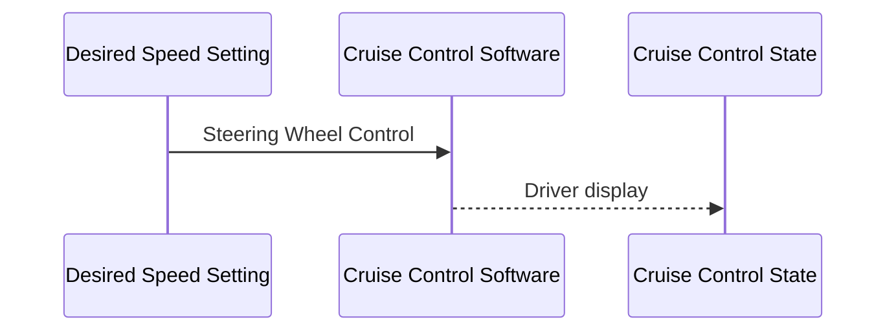
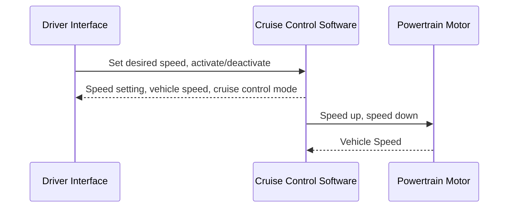

# foundations-flight-test

## Control Diagram

Dotted line represents 

```mermaid
sequenceDiagram
    Desired Speed Setting ->> Cruise Control Software: Steering Wheel Control
    Cruise Control Software -->> Cruise Control State: Driver display
```

```mermaid
sequenceDiagram
    Driver Interface ->> Cruise Control Software: Set desired speed, activate/deactivate
    Cruise Control Software -->> Driver Interface: Speed setting, vehicle speed, cruise control mode
    Cruise Control Software ->> Powertrain Motor: Speed up, speed down
    Powertrain Motor -->> Cruise Control Software: Vehicle Speed
```
